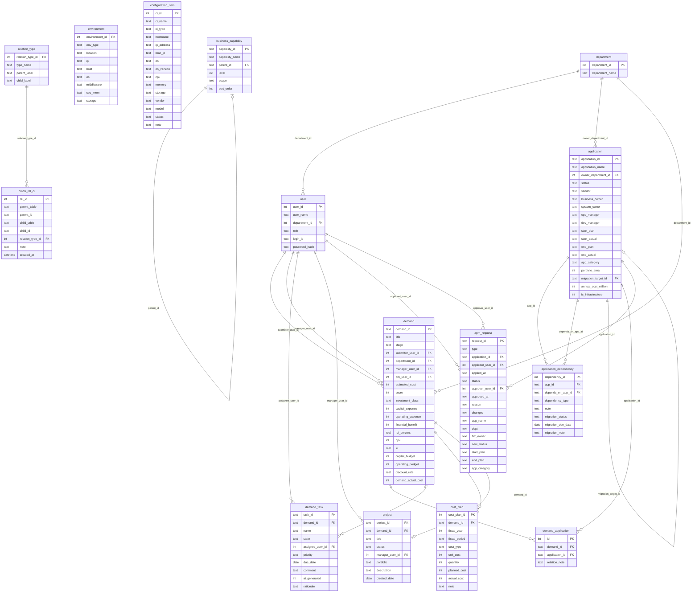

# DBスキーマ設計

## ERD（Mermaid）

## テーブル一覧

| テーブル | 主な用途 |
|---------|---------|
| department | 部門マスター |
| user | ユーザー・認証情報 |
| application | システム（アプリケーション）台帳 |
| environment | サーバー環境 |
| configuration_item | 構成アイテム（CI） |
| relation_type | CMDBリレーション種別マスター |
| cmdb_rel_ci | アプリ↔環境↔CIの汎用リレーション |
| business_capability | ビジネスケイパビリティ（L1/L2） |
| application_dependency | アプリ間依存関係 |
| demand | デマンド（IT投資申請） |
| demand_application | デマンド↔システム紐付け |
| demand_task | デマンドに紐づくタスク |
| cost_plan | コスト計画（計画/実績） |
| project | デマンドから生成されたプロジェクト |
| apm_request | システム変更申請 |

## 設計上の重要事項

- environment・CIのFKは廃止済み。cmdb_rel_ci経由でのみ親子関係を管理
- ケイパビリティ↔システムの紐付けはcmdb_rel_ci（type_name='realizes'）を流用
- CIリレーション一覧画面ではrealizes除外表示

## relation_type マスター

| type_name | parent_label | child_label | 用途 |
|-----------|-------------|-------------|------|
| has_environment | 環境を持つ | 環境である | application→environment |
| has_ci | 構成情報を持つ | 構成情報である | environment→CI |
| realizes | ケイパビリティ | 実現システム | capability→application |
