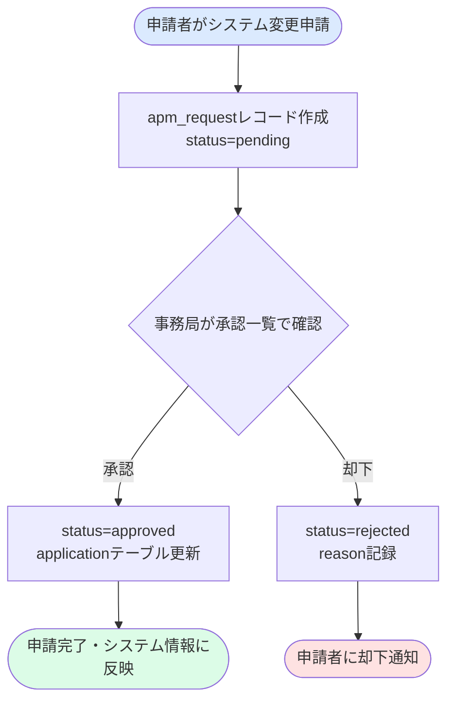
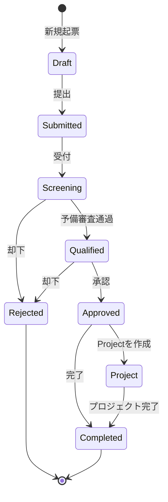
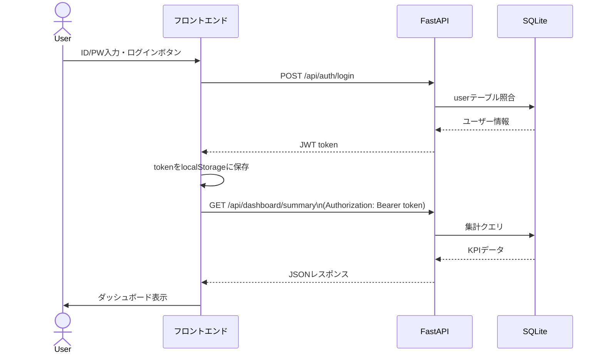
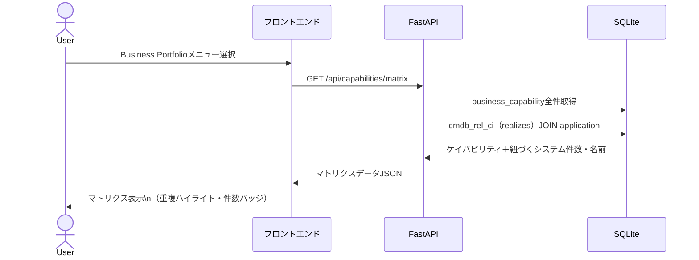
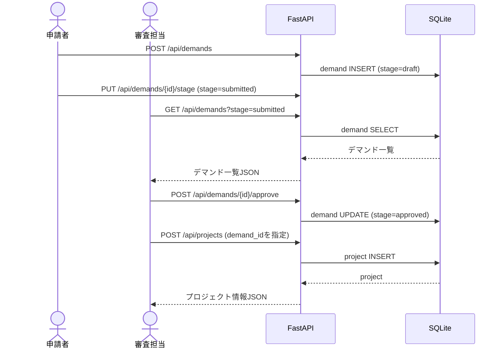

# ワークフロー・状態遷移図

## 1. 申請・承認ワークフロー

```mermaid
flowchart TD
    A([申請者がシステム変更申請]) --> B[apm_requestレコード作成\nstatus=pending]
    B --> C{事務局が承認一覧で確認}
    C -->|承認| D[status=approved\napplicationテーブル更新]
    C -->|却下| E[status=rejected\nreason記録]
    D --> F([申請完了・システム情報に反映])
    E --> G([申請者に却下通知])

    style A fill:#dbeafe
    style F fill:#dcfce7
    style G fill:#fee2e2
```

## 2. デマンドのステージ遷移

```mermaid
stateDiagram-v2
    [*] --> Draft : 新規起票
    Draft --> Submitted : 提出
    Submitted --> Screening : 受付
    Screening --> Qualified : 予備審査通過
    Screening --> Rejected : 却下
    Qualified --> Approved : 承認
    Qualified --> Rejected : 却下
    Approved --> Completed : 完了
    Approved --> Project : Projectを作成
    Project --> Completed : プロジェクト完了
    Rejected --> [*]
    Completed --> [*]
```

## 3. API通信フロー

### ログイン〜画面表示

```mermaid
sequenceDiagram
    actor User
    participant Browser as フロントエンド
    participant API as FastAPI
    participant DB as SQLite

    User->>Browser: ID/PW入力・ログインボタン
    Browser->>API: POST /api/auth/login
    API->>DB: userテーブル照合
    DB-->>API: ユーザー情報
    API-->>Browser: JWT token
    Browser->>Browser: tokenをlocalStorageに保存
    Browser->>API: GET /api/dashboard/summary\n(Authorization: Bearer token)
    API->>DB: 集計クエリ
    DB-->>API: KPIデータ
    API-->>Browser: JSONレスポンス
    Browser->>User: ダッシュボード表示
```

### Business Portfolio マトリクス表示

```mermaid
sequenceDiagram
    actor User
    participant Browser as フロントエンド
    participant API as FastAPI
    participant DB as SQLite

    User->>Browser: Business Portfolioメニュー選択
    Browser->>API: GET /api/capabilities/matrix
    API->>DB: business_capability全件取得
    API->>DB: cmdb_rel_ci（realizes）JOIN application
    DB-->>API: ケイパビリティ＋紐づくシステム件数・名前
    API-->>Browser: マトリクスデータJSON
    Browser->>User: マトリクス表示\n（重複ハイライト・件数バッジ）
```

### デマンド申請フロー

```mermaid
sequenceDiagram
    actor Applicant as 申請者
    actor Manager as 審査担当
    participant API as FastAPI
    participant DB as SQLite

    Applicant->>API: POST /api/demands
    API->>DB: demand INSERT (stage=draft)
    Applicant->>API: PUT /api/demands/{id}/stage (stage=submitted)
    Manager->>API: GET /api/demands?stage=submitted
    API->>DB: demand SELECT
    DB-->>API: デマンド一覧
    API-->>Manager: デマンド一覧JSON
    Manager->>API: POST /api/demands/{id}/approve
    API->>DB: demand UPDATE (stage=approved)
    Manager->>API: POST /api/projects (demand_idを指定)
    API->>DB: project INSERT
    DB-->>API: project
    API-->>Manager: プロジェクト情報JSON
```
